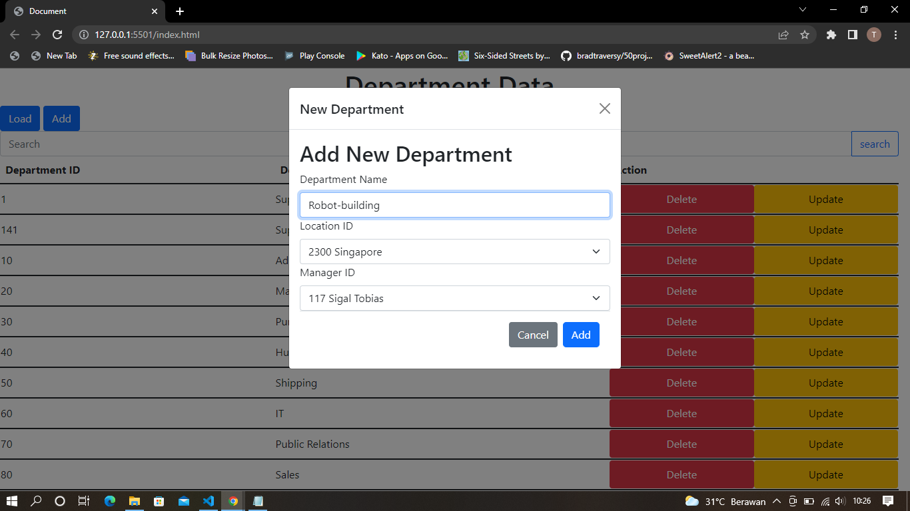
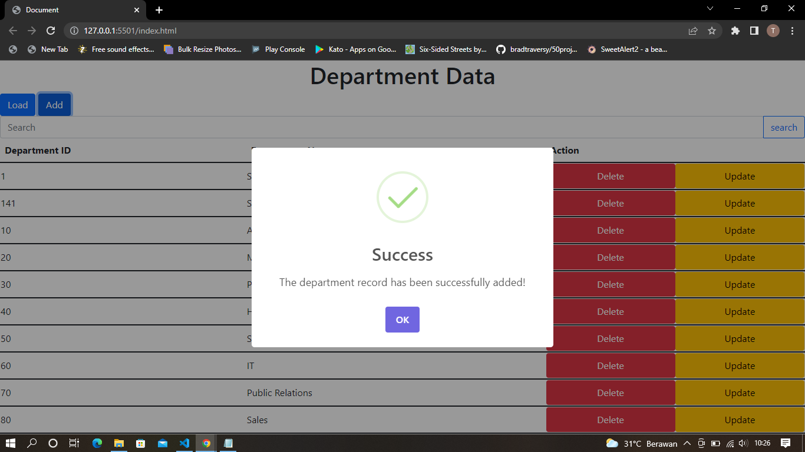
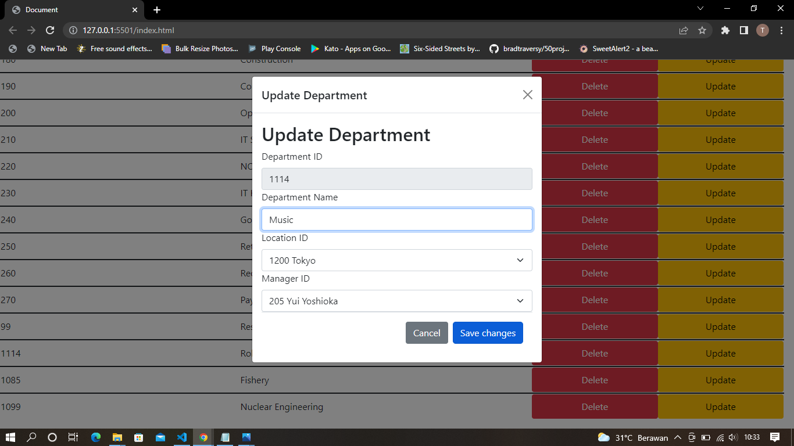
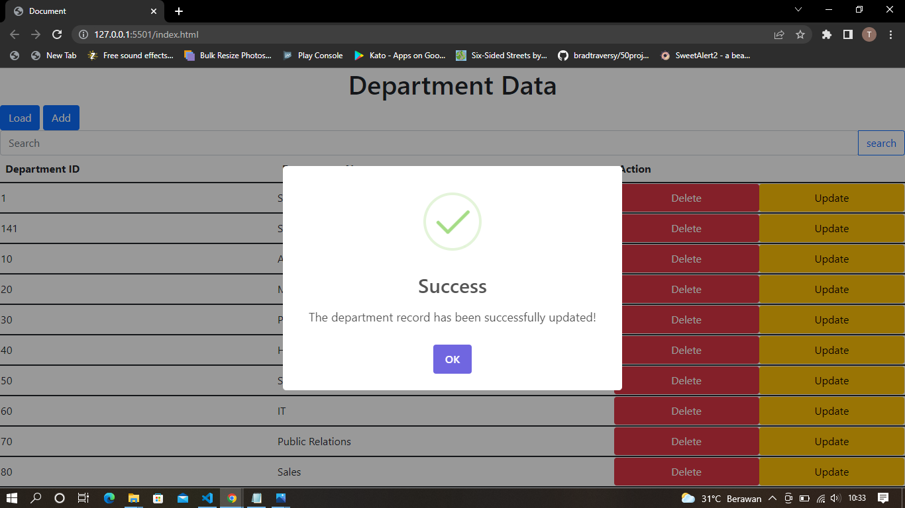
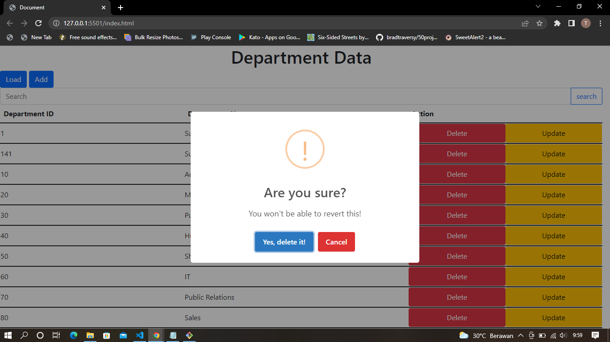
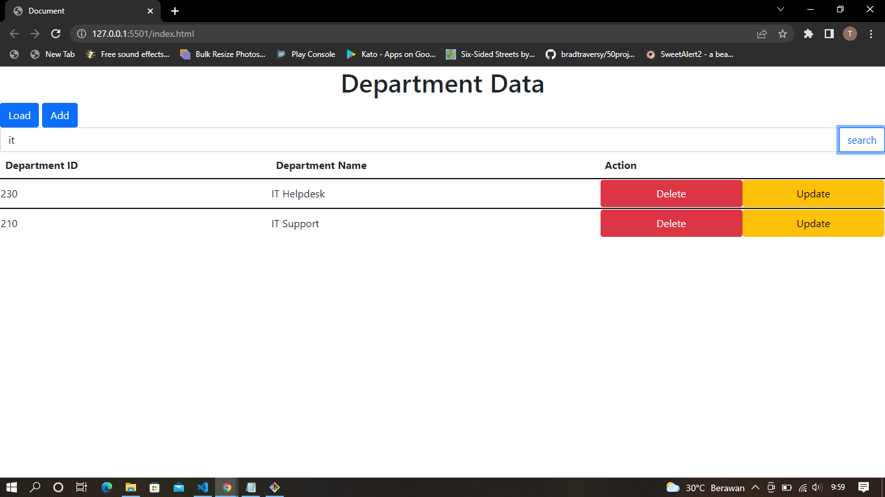
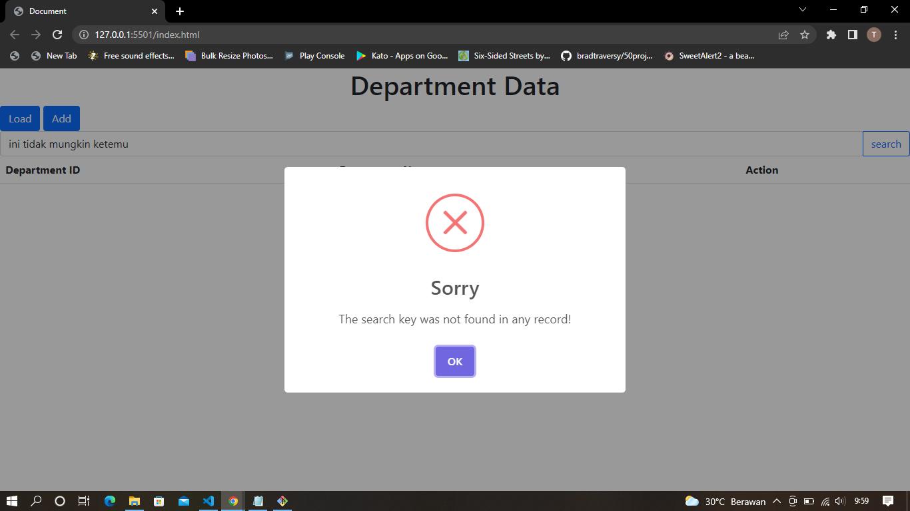
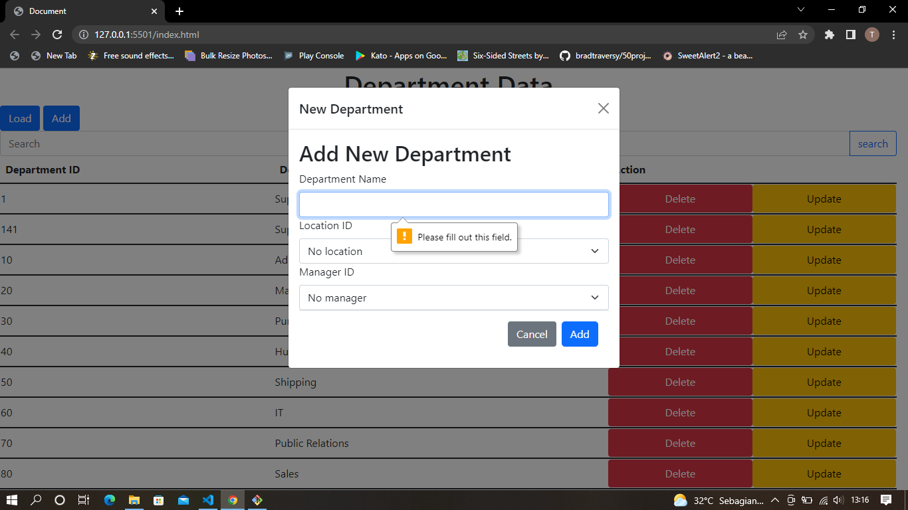
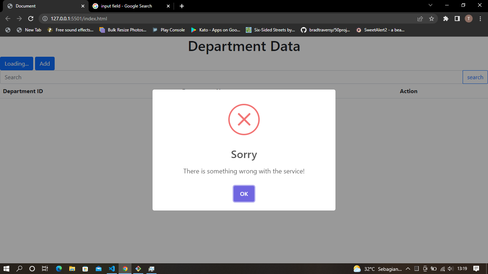

# Department Data Management App
This is a simple website page created using HTML, CSS (with Bootstrap framework), and (vanilla) Javascript to manage my department table. 

## Features
- [x] Add new record to the database 
- [x] Show all the records
- [x] Update existing records
- [x] Delete (with confirmation) existing records
- [x] search records by name
- [x] validate input field

## Preview
Of course, the website page won't run well unless you can call my local API. So, here I will give some screenshots to give some glimpse of what this website page looks like.
### Adding New Department

### Updating Department

### Deleting Department

### Searching Department (By Name)

### Validating input field

### Error alert
I intentionally disabled the website service (to see the error alert) and this was the alert.

